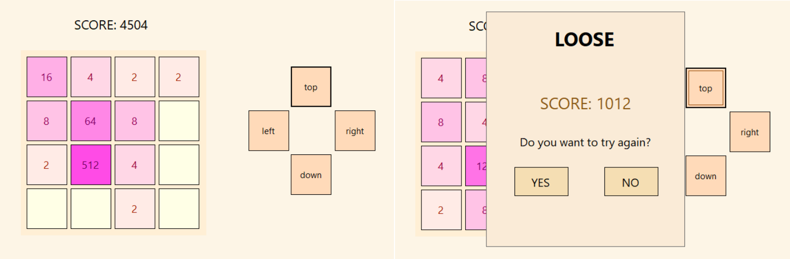

# 2048 written in Windows Forms C#
## Table of contents
* [Description](#description)
* [Overwiev](#overwiev)
*[Technologies](#technologies)

## Description
Project is a copy of 2048 game written in C# using Windows Forms.
The main purpose of my vervios this game is reaching the value of 2048 on 1 of 16 puzzles. It is possible to move puzzles by buttons or keyboard (a,w,s,d).

## Overview

## Technologies
Project is created with Windows Forms C#.
